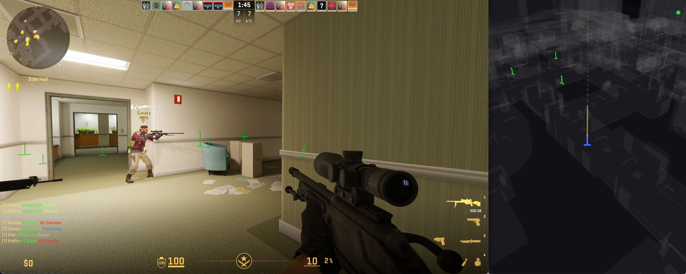
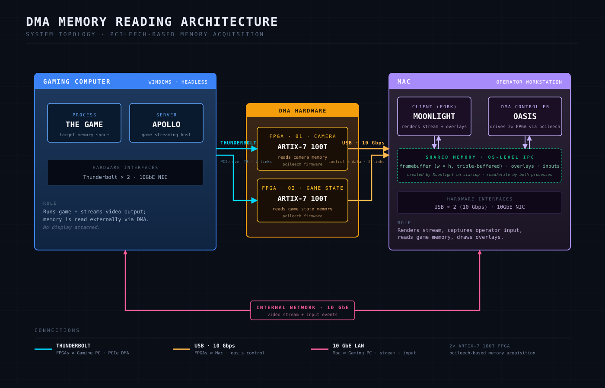

### Warning: AI Slop Ahead. Use at Your Own Risk!

Most of the code in this branch has been generated by Claude Code (Opus 5.5). The code in the [`main`](https://github.com/dkrutsko/oasis/tree/main) has been verified and accepted by a human.

# Oasis



Oasis is a real-time game assistance tool that uses FPGA-based DMA (Direct Memory Access) to read game memory, analyze player positions and skeletal data, and provide intelligent triggerbot and overlay functionality. It integrates hardware-level memory reading with 3D spatial geometry calculations and input synthesis via shared memory.

## Diagram



## Features

- **DMA Memory Reading** - Direct hardware access via FPGA (FT601 USB) to read process memory without kernel hooks
- **Real-time Entity Tracking** - Reads player positions, view angles, and bone data at configurable frame rates. Entity pointers are cached between frames and validated again in a few batched scatter reads per frame
- **Intelligent Triggerbot** - Ray-cast intersection with head and body hitboxes, with configurable cooldowns
- **Line-of-Sight Verification** - Uses map collision geometry (`.tri.zst` or `.tri` files) with BVH spatial acceleration to prevent firing through walls
- **Map Extraction** - `./extract.sh` downloads the CS2 maps and converts the ones that changed into compressed collision files
- **Dual FPGA Support** - Separate devices for action and camera reads to avoid USB contention
- **Overlay Rendering** - Outputs entity data to shared memory for use with Moonlight streaming
- **3D Map Viewer** - GPU-accelerated viewer using SDL3 (Metal or Vulkan, loaded with purego) for visualizing collision geometry and entities
- **Cross-Platform** - Targets macOS (Intel + ARM + Universal) and Linux (x86_64/ARM64). The input and overlay services do not support Windows yet
- **Structured Logging** - JSON or colored text output with debug mode
- **Health Monitoring** - Goroutine heartbeat detection for service health
- **Built-in Profiling** - Optional pprof server on localhost:6060, and `./profile.sh` to profile whole sessions

## Requirements

- Go 1.27.1+
- FPGA hardware (FT601-based) with LeechCore/VMMDLL drivers
- Make (for build commands)
- `zstd`, `jq`, `curl` and `unzip` (for map extraction)
- `shellcheck` (for `./check.sh`)

## Getting Started

- Use this [modified version](https://github.com/dkrutsko/moonlight-qt) of Moonlight streaming software to stream the game.
- Download memory offsets using `./dump.sh` or by downloading `offsets.json` and `client_dll.json` from [this repository](https://github.com/a2x/cs2-dumper).
- Download [pcileech](https://github.com/ufrisk/pcileech/releases/tag/v4.19) for the operating system you're planning on running this software.
- Run `./downloader.sh` once to download DepotDownloader, then `./extract.sh` to extract the map collision data into `./bin/maps`. Run `./extract.sh` again after game updates, it only extracts the maps that changed.

## Building

```
# Run from source code. Oasis runs from ./bin, where it
# finds its offsets and the maps extracted by extract.sh.
cd ./bin
go run .. --viewer3d
```

```
# Show available commands
make help

# Build release binary
make build

# Build debug binary (with race detection and GDB support)
make debug

# Build the map extractor used by extract.sh
make extractor

# Clean build artifacts, including the extracted maps
make clean

# Cross-compile for all platforms
make publish
```

The release binary is output to `./bin/oasis`. No build tags or extra environment variables are needed, the 3D viewer is part of every build.

## Usage

```
oasis [flags]
```

### Flags

| Flag | Default | Description |
|------|---------|-------------|
| `--version` | | Print version info and exit |
| `--debug` | | Enable verbose debug logging |
| `--json` | | Enable JSON-formatted output |
| `--viewer` | | Launch the debug overlay viewer |
| `--viewer3d` | | Launch the GPU-accelerated 3D map viewer |
| `--pprof` | | Start pprof server on localhost:6060 |
| `--action` | First device | FPGA device index for action/entity reads |
| `--camera` | First device | FPGA device index for camera reads |
| `--rate` | | Set both action and camera frame rates (Hz) |
| `--rate-action` | `60` | Target frame rate for action reads (Hz) |
| `--rate-camera` | `90` | Target frame rate for camera reads (Hz) |
| `--maps` | `./maps` | Directory containing `.tri.zst` or `.tri` map collision files. An empty value disables line-of-sight checks |

### Examples

```bash
# Run with default settings (single FPGA)
oasis

# Run with dual FPGAs
oasis --action 0 --camera 1

# Run with higher frame rates
oasis --rate 120

# Launch the 3D map viewer for debugging
oasis --viewer3d

# Run with JSON logging and debug output
oasis --debug --json
```

## Map Collision Data

`./extract.sh` builds the collision data for line-of-sight checks and the 3D viewer:

1. DepotDownloader (installed into `./bin/depotdownloader` by `./downloader.sh`) downloads the file list of the CS2 depot anonymously.
2. Each map VPK in `game/csgo/maps` is compared with its checksum in `./bin/maps/manifest.json`. Maps that changed, or whose `.tri.zst` file was deleted, are downloaded one at a time.
3. `./bin/extractor` converts the collision geometry of each map into a `.tri` file, which is compressed with `zstd -19` into `./bin/maps/<map>.tri.zst`. Menu and preview VPKs without world physics are skipped.
4. The manifest records the checksum and result of each map. Maps that fail are tried again on the next run, and `--force` extracts every map again.

Oasis loads `<map>.tri.zst`, or an uncompressed `<map>.tri`, from `--maps` when the game changes maps. Map names that are not plain file names, such as workshop maps, get no collision data.

## Development

- `./check.sh` normalizes file permissions, lints every script with shellcheck, tidies the Go modules, formats the Go code and runs static analysis.
- `./profile.sh -- [oasis flags]` builds Oasis and profiles a whole session until Oasis exits or Ctrl+C is pressed. CPU profiles, execution traces, heap and goroutine snapshots, native memory snapshots and process stats are written to `./bin/profiles/<date>-<time>`.

## Project Structure

```
oasis/
	main.go          Entry point and service orchestration
	config/          CLI argument parsing, versioning, splash screen
	extractor/       Converts CS2 map VPKs into .tri collision files
	game/            Core game state, entity tracking, triggerbot, health monitor
	geometry/        3D collision primitives (Ray, Box, Sphere, Capsule, Cylinder)
	input/           Input synthesis via shared memory (keyboard/mouse)
	leech/           FPGA/DMA memory access wrapper (LeechCore/VMMDLL)
	logger/          Structured JSON/text logging
	maps/            Map collision geometry loading (.tri.zst and .tri files) and BVH acceleration
	math/            Vector/matrix math library (Vector2/3/4, Matrix3/4, Quaternion)
	overlay/         Overlay renderer (shared memory output for Moonlight)
	shm/             Cross-platform shared memory (SysV on Unix, Windows API)
	viewer3d/        GPU-accelerated 3D map viewer (SDL3) with FPS camera
	errors/          Custom structured error handling
	utility/         Git metadata embedding
	check.sh         Permissions, linting, formatting and static analysis
	dump.sh          Downloads the latest offsets
	downloader.sh    Downloads DepotDownloader for extract.sh
	extract.sh       Extracts the map collision data into ./bin/maps
	profile.sh       Profiles an Oasis session
```

## Architecture

The application runs as a set of concurrent services managed by an `errgroup`:

1. **Game** - Reads entity state and camera data from game memory via DMA
2. **Overlay** - Renders entity positions to shared memory for the streaming overlay
3. **Input** - Listens on shared memory for input synthesis commands
4. **Keys** - Reads key/mouse state for hotkey detection (trigger activation)
5. **Trigger** - Evaluates crosshair-to-hitbox intersection and fires when conditions are met
6. **Health Monitor** - Tracks goroutine heartbeats and detects stalls
7. **Viewer3d** (optional) - GPU-accelerated 3D visualization on the main thread

The entity reader keeps the pointers from each entity list slot to its player data between frames. Every frame reads them again together with the data in batched scatter reads, and only uses the data when none of them changed. Batches are sized to what the FPGA can keep in flight, since reads beyond that stall for several milliseconds.

The 3D viewer embeds the SDL3 library and loads it at runtime, so nothing has to be installed. Its WGSL shaders are compiled at startup with naga into MSL for Metal or SPIR-V for Vulkan.

Graceful shutdown is handled via SIGINT/SIGTERM with a 2-second timeout before force exit.
